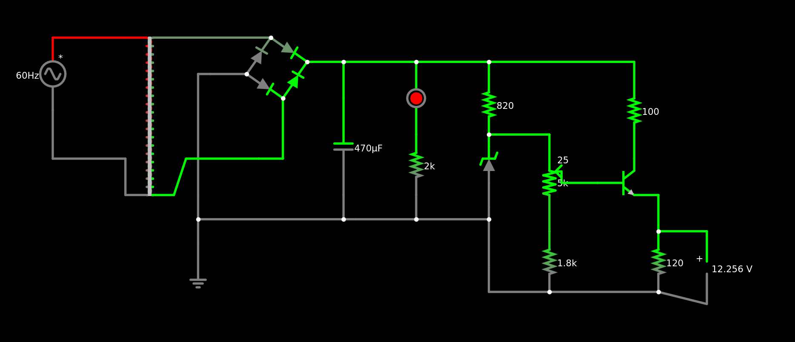

# Trabalho 1 - Fonte de Tensão Ajustável
Projeto realizado para a disciplina '[SSC0180] – Eletrônica para Computação', ministrada pelo professor Eduardo do Valle Simões. Neste projeto, busca-se projetar uma fonte de tensão ajustável entre 3v e 12v, com uma corrente de 100mA. 

# Integrantes - Grupo 17

| **Nome**              | **N°USP**|
|--------------------------------|----------|
| Bruna Izabel da Silva Pereira| 15635441 | 
| Camilli Gabrielli Ramos Muniz| 15635722 |
| [Laura Fernandes Camargos](https://github.com/laurafcamargos)| 13692334 |
| [Sandy da Costa Dutra](https://github.com/sandycdutra)| 12544570 |

# Objetivo
Projetar e montar uma fonte de tensão ajustável (corrente contínua) entre 3v e 12v, com capacidade de 100mA. Ela deve ser capaz de receber uma corrente alternada de tensão eficaz de 127v e fornecer uma corrente contínua.

# Diagrama da Fonte

[Link para o circuito no Falstad](https://tinyurl.com/2ehnnvpj)

# Escolha de Componentes

| Quantidade  | Componente  | Especificações   | Valor  |
|---|---|---|---|
| 1 | [Ponte de Diodos] | Ponte Retificadora KBPC1010 |R$3,67| 
| 1 | [Capacitor] |470µF, 35V|R$2,80|
| 1 | [LED] |Vermelho 5mm|R$0,50|
| 1 | [Diodo Zener]( |1N4743 [13V / 1W]|R$0,50|
| 1 | [Potenciômetro] |10000Ω|R$1,61|
| 1 | [Resistor CR25 820] |820Ω +/-5%, 2W|R$0,07|
| 1 | [Resistor CR25 1k] |1000Ω +/-5%, 1W|R$0,07|
| 1 | [Resistor CR25 100] |100Ω +/-5%, 2W|R$0,07|
| 1 | [Resistor CR25 1.8k] |180Ω +/-5%, 2W|R$0,07|
| Total | | |R$|

#### Ponte de Diodods
> * Esse componente pode ser feito com 4 diodos, porém é mais fácil comprá-lo pronto. Sua função é garantir que a corrente apenas flua em um sentido. Ela segue sendo alternada, porém não 'desce' abaixo do 'zero'. 
> * No gráfico, ela funciona como se fosse um módulo. Ou seja, quando aplicada em uma corrente alternada (senoide), ela 'joga' os pontos 'negativos' para o 'positivo'.

#### Capacitor
> * O capacitor serve para armazenar temporariamente uma certa carga durante um periodo de auta crescente da tensão e descarrega no período subsequente. Assim, ele serve para "atenuar" a queda da tensão, mantendo a tensão máxima inalterada, porém elevando a tensão máxima. 

#### Zenner
> * Serve para 'filtrar' o excesso de corrente. Escolhe-se um valor abaixo da tensão mínima no ponto C (considerando o capacitor) para assim eliminar ou mitigar o ripple - isto é, tornar a corrente de fato contínua. 
> * A potência máxima do diodo zener escolhido é bem mais elevada do que o necessário segundo os cáculos (0.5w > 0.0137W), o que garante uma margem de segurança agradável.

#### Led
> * Apenas serve para indicar a passagem de corrente para o usuário. Se trata de um componente facultativo.

#### Potenciômetro Linear
> * Serve para regular a voltagem que passará pelo transistor. Dessa forma, é possível ajustar a tensão de acordo com o dispositivo conectado (entre 3v e 12v).

#### Resistores
> * Servem para limitar a quantidade de corrente que passam pelo circuito. 
> * Os valores das resistencias foram aproximados para valores comerciais. Entretanto, estes resistores ainda são um pouco difíceis de se achar. Assim, uma alternativa e comprar resistores mains comuns e assossia-los de modo que a resistência equivalente seja aproximadamente igual ao modelo inicialmente planejado.
> * (1.8k ≅ 1k + 0.5k), (2.2k ≅ 2k).

#### Transistor NPN
> * Serve para ajustar de fato a corrente que será alimentada ao dispositivo. Ele aplifica a corrente sem exigir que uma grande corrente passe pelo resistor ligado ao zener. 
> * É a resposta para: como é possível ter um resistor grande o suficiente para evitar que o zener queime e pequeno o bastante para alimentar o dispositivo com a corrente necessária? Simples, com um transistor NPN.
> * Um 'defeito' natural desse tipo de transistor é que ele não pode passar mais tensão do que a tensão da base - 0.7. Porém, nesse caso, isso é uma vantagem, pois mesmo com uma corrente muito pequena, a base do transistor será capaz de estabelecer uma tensão máxima. 

  

# Projeto Esquemático do PCB no Software Eagle

